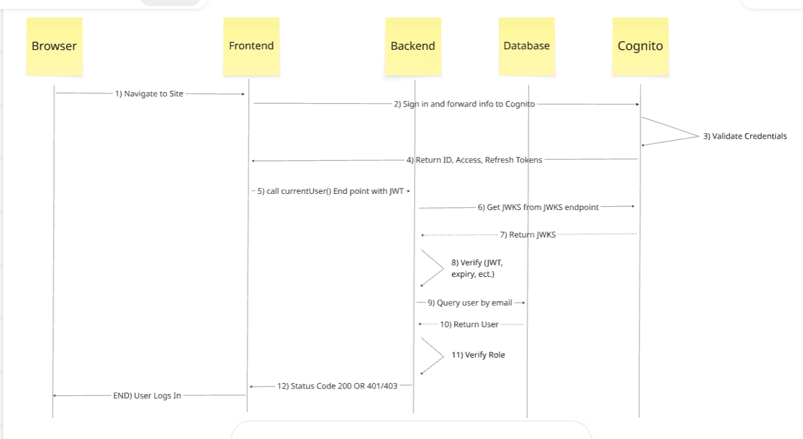

# Authentication

The auth diagram can be found in the [Miro board](https://miro.com/app/board/uXjVHjLwe7Y=/).

## Request flow

1. `JwtAuthGuard` calls Passport with the strategy name `jwt`.
2. Passport finds the registered `JwtStrategy`.
3. `JwtStrategy` extracts and validates the Cognito JWT from the `Authorization: Bearer <token>` header.
4. The strategy checks the token signature, issuer, audience, expiration, and required Cognito claims.
5. The strategy's `validate()` result becomes `request.user`.
6. A route decorated with `@UseGuards(JwtAuthGuard)` can return or use that identity, such as `GET /api/auth/me`.

Routes are public by default. Add `@UseGuards(JwtAuthGuard)` to a controller or route when authentication is required. The `@ApiBearerAuth()` decorator documents the requirement in Swagger; it does not perform authentication itself.

## Files

- `jwt.strategy.ts` validates Cognito ID tokens and returns `{ sub, email }`.
- `jwt-auth.guard.ts` connects NestJS routes to Passport's `jwt` strategy.
- `authenticated-identity.ts` defines the TypeScript shape of the authenticated user.
- `auth.controller.ts` exposes authentication-related endpoints.
- `auth.module.ts` registers the Passport module, controller, and strategy.
